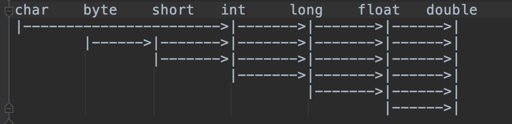

# Think in java 读书笔记
## pikzas
## 2019.03.06
## 第五章 初始化与清理
> Think in Java 中该章节的内容只是初步介绍了一些语法层面的内容，具体的细节需要参考之后的另一本书周志明的《深入理解Java虚拟机》
## 知识点
### 方法重载 方法名相同 但是参数列表不同
* 参数的个数
* 参数的类型
* 参数的顺序
### 基本数据类型参数的重载
#### 基本参数类型可以从一个较小的类型转为一个较大的类型，但是有些要注意

#### 可以看到char是特例 char类型会直接提升到int类型。
#### 反之 如果实参是较大的数据类型，而形参是较小的数据类型。则在调用的时候需要显示强转。表明你已经认识到可能会有丢失数据精度的可能。
#### 一个认知错误的地方就是，不可能依据返回值的不同来重载方法。因为返回值不是方法签名中的一员。
### 一旦手动改写了构造函数，则编译器就不会为我们隠式添加默认的构造函数。
### this关键字指的是调用当前类中某个方法的对象是谁，所以this关键字只可能存在于方法之内。
#### this的一个应用就是用来返回自身对象
```java
class Demo{
    int i = 0;
    Demo increment(){
        i++;
        return this;
    }
    void print(){
        System.out.println("i = "+i);
    }
    public static void main(String[] args){
        Demo demo = new Demo();
        demo.increment().increment().increment().print();
    }
}
//output 
//i = 3
```                   
### 构造器中可以调用别的构造器，但是某个构造器中只能调用最多一次其他构造器，并且调用的代码必须写在该构造器的第一行，同时方法中不能调用构造器。
#### 你的构造器都没执行完，对象都没有创建成功，就不要想搞别的东西。
### static关键字的含义
#### static表示，我是类固有的属性或者方法，不需要依托于该类对象，就能够存在。所以static声明的属性或者方法，在编译器加载.class文件的时候，就被放到内存当中了。所以无论你new出了多少对象，我还是只有一份。
### java 中垃圾回收器是如何工作的 
* JVM 如果不是在内存即将耗尽的前提下，垃圾回收器是不会去执行垃圾回收的。
* Java 垃圾回收器是 自适应 分代的 停止-复制（stop-copy） 标记-清扫（mark-sweep）式的

#### 自适应 系统处于不同运行阶段，使用不同的垃圾回收策略
#### 分代的 处于稳定期的系统，会对内存分块，同时标记上所处的代数，新生代、老生代、伊甸区。。。
#### 停止-复制 刚启动的系统，加载的新对象较多，需要频繁的分配内存、整理内存。在通过对堆栈和静态存储区中对象标记，找出不在使用的死对象之后，将其内存回收，同时整理空间，此时程序会停止。
#### 标记-清扫 对于较早版本的jvm，如果系统处于稳定期，会同样对内存进行标记，清扫只有内存不够用的时候才会发生。一旦发生，系统也会停止一会。

### 成员初始化
* 类中的字段（全局变量），如果未给定值，基本数据类型会默认给0、0.0或者空，引用数据类型会给null
* 方法中的字段（局部变量），不给定初始值，编译器就会报错。

#### 全局变量的初始化方式-指定初始化
* 可以直接给特定的值
```java
class Demo{
    int i = 123;
}

```
* 调用方法来赋值
```java
class Demo{
    int i = fun(); 
    int j = fun2(i);
    int fun2(int in){
        return 2*in;
    }
    int fun(){
        return 11;
    }
}

```
### 构造器初始化
#### 构造器初始化之前，默认的成员初始化一定会发生，该类被分配到内存上的时候，就给所有的全局变量指定了默认值。
#### think in java 中文第四版(94页)
```java
class Counter{
    int i;
    Counter(){
        i = 7;
    }
}
```
我们无法阻止自动初始化的进行，它将在构造器被调用之前发生。就是 i首先会被置0，然后变成7。对于所有基本类型和引用类型，包括在定义的时候已经指定初始值的变量，这种情况都是成立的。
所以我们在并发的时候要考虑到，对象只进行了自动初始化，构造器还尚未调用的情况，这时候的产生的对象是不完整的对象。

###初始化顺序
1 静态对象先初始化（如果之前该类已经实例化过，静态对象就不会再次加载了）
2 然后是非静态对象 
3 最后是构造器

### 初始化实际的执行流程
1 查找*.class文件
2 载入class文件 创建一个Class对象 然后所有静态对象初始化
3 new 对象的时候，首先在堆上分配足够的内存 （静态属性都加载完了）
4 将这块内存区域空间置0 （自动初始化的结果，所有数据先开始是0或者空）
5 执行类中定义的赋值操作 （所有非静态属性有了设定的值）
6 指定构造器 （构造器被调用，可能导致对象的属性发生变化，还可能会导致父类被调用。。。）

#### 静态代码块
```java
class Cup{
    static Cpu cup1;
    static Cpu cup2;
    static {
        cup1 = new Cup(); // 只有该对象第一次创建的时候才会执行
        cup2 = new Cup();
    }
}
```
#### 非静态代码块 
```java
class Cup{
    Cpu cup1;
    Cpu cup2;
    {
        cup1 = new Cup();  // 每new一个该对象的时候都会执行一次
        cup2 = new Cup();
    }
}
```
### 数组的初始化
* int[] arrays;
* int arrays[]; 两种定义方式都可以。

#### 数组默认有一个属性length 表明数组内对象的的个数，且数组的下标是从0开始的，所以最大值为length-1

### 可变参数列表
```java

class Demo{
    void fun(Object... objs){
        //objs 就是一个数组
    }
}
```
#### 所以在调用fun()的时候，实参可以直接是个数组对象，如fun(new Object[]{1,2,3})。也可以是一串对象，如fun(1,2,3),这时候会自动转换为一个数组作为参数。也可以什么都不传入。
#### 可变参数列表与方法重载之间的冲突 由于可以接受可变参数的方法，也可以什么入参都没有，如果同时又两个可变参数列表的方法，都不传入入参，此时就会爆出编译器错误。
```java
class Demo{
    static void f(Character... cs){print("first");}
    static void f(Integer... ins){print("second");}
    static void f(Long... ls){print("third");}
    public static void main(String[] args){
        //f(); 这时候会提示编译错误，因为方法f被重载了三次，而不传入参数都可以调用，编译器判定不了，所以报错。
    }
}

```
 
### 枚举 也是一个类，只是java默认添加了很多方法，也可以通过接口来实现。但是较为复杂。而且枚举的实现是线程安全的

```java

public enum Smile{
    HAHA,XIXI,HEHE
}
```

#### 自带的一些方法
* ordinal() 按照定义顺序，从0开始计数
* toString() 转为字面量（定义顺序未被写入toString方法）
* values() 获得由字面量组成的数组
```java
class Demo{
    public static void main(String[] args){
      for(Smile s: Smile.values()){
          System.out.println(s + ". ordinal " + s.ordinal());
      }
    }
}
//output
// HAHA. ordinal 0
// XIXI. ordinal 1
// HEHE. ordinal 2
```

#### 枚举和switch case并用
```java
switch(Smile){
    case HAHA: sout(1111) break;
    case XIXI: sout(2222) break;
    case HEHE: sout(3333) break;
    default: sout(4444);
}
```
